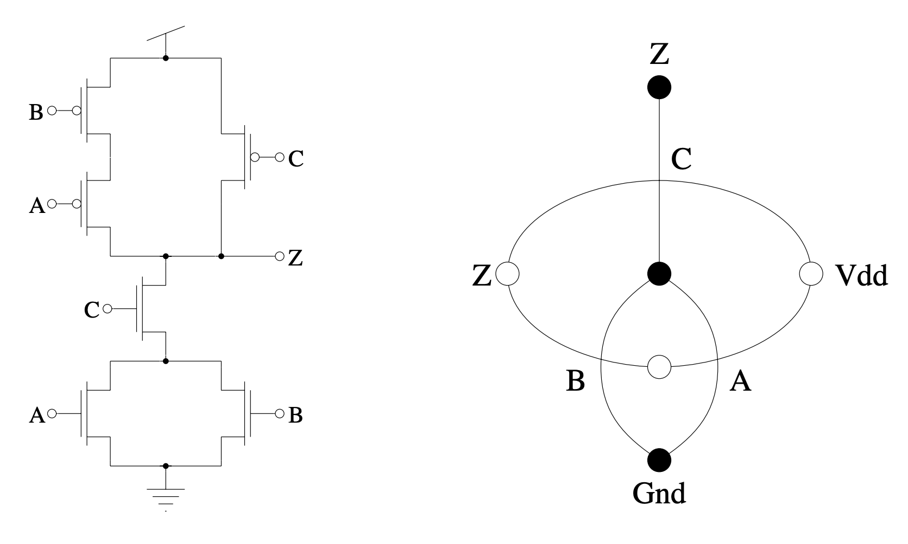

# Euler Path Circuit Matcher

## Background

In the last half century, integrated circuits have shaped our modern society into what it is today. Virtually all of the technology we interact with today, from laptops, phones, cars, communication systems, sensors, satellites, and more, have evolved because of advancements in integrated circuit technology.

One design constraint IC designers often face is the size of the chip. Making the circuit layout as compact as possible is vital because it allows for more transistors to be placed in a given area, especially for digital systems with millions or billions of transistors. Although advancements in photolithography have allowed for the fabrication of smaller and smaller devices, it is still important for the designer to minimize the area of their layout to lower costs.

A transistor in a digital system can be modeled as a three-terminal device with a drain, source, and gate. For nMOS transistors, when the gate voltage is high, this acts as a switch on to let current flow from the drain to the source. When the gate voltage is low, no current flows through the channel (drain to source). pMOS transistors are complementary to nMOS transistors, so they allow current through the channel when the gate voltage is low and stop current flow when the gate voltage is high.

In digital systems, logic gates (circuits that perform boolean logic) can be created by combining pMOS transistors and nMOS transistors into a single circuit. The pMOS transistors comprise the pull-up network (PUN) and the nMOS transistors make up the pull-down network (PDN).

During the layout process, the designer creates transistors by designating boxes that represent the drain, source, and gate regions. The gate is made with a polysilicon layer that is overlayed on top of a layer of doped silicon. The doped silicon layer extends on either side of the gate, and these make up the source and drain regions.

There are two major ways a digital IC designer can decrease the footprint of their layout. The first is to optimize source-drain region sharing. If two transistors are in series, the source of one and the drain of other have the same voltage. We can use this to minimize the layout size by combining the source-drain region of the transistors in the layout. Maximizing source-drain region sharing will optimize the layout footprint of the PUN and PDN.

The other way to optimize the layout footprint is to avoid crossing polysilicon wires. Since the PUN and PDN in a logic gate receive the same input voltages, the polysilicon layer that makes up the gate of the transistors has to be connected between the PUN and PDN. If the transistors in the PUN and PDN are ordered in the same way, this would allow the polysilicon to be routed vertically without crossing.

To find the optimal layout that maximizes source-drain region sharing and avoids polysilicon wires crossing, an IC designer can employ Euler paths. First, the designer must create two graphs (for the PUN and PDN respectively) where the vertices are nodes in a circuit and the edges represent transistors. Then, they can find a Euler path in each of the graphs and layout the transistors in the order the edges in the graph were traversed to maximize source-drain region sharing. If the Euler path in the PUN and PDN traverse the edges in the same order, this avoids crossing polysilicon wires.

## Python Tool

Our python script assists IC engineers in finding the optimal layout by automatically finding matching Euler paths in both the PUN and PDN. Using the script requires the user to create a graph in the python script where the edges represent MOSFETS and the vertices represent the connections between the MOSFETS.

## Example Usage

The example below finds the optimal poly orderings for this circuit:


Credit: Bradley Minch

```python
if __name__ == "__main__":
    # Simple Circuit

    # Pull up network
    pull_up_network = Graph()

    # The first two arguements are the nodes that the MOSFET is connected
    # to. The third arguement is the name of the MOSFET. In this case,
    # the MOSFET is named "C" and is connected to nodes "Z" and "VDD".
    pull_up_network.add_edge("Z", "VDD", "C")
    pull_up_network.add_edge("VDD", "AB", "A")
    pull_up_network.add_edge("AB", "Z", "B")

    pull_up_network.find_euler_paths()

    # Pull down network
    pull_down_network = Graph()

    pull_down_network.add_edge("AB", "Z", "C")
    pull_down_network.add_edge("AB", "GND", "A")
    pull_down_network.add_edge("AB", "GND", "B")

    pull_down_network.find_euler_paths()

    poly_orderings = find_matching_sequences(
        pull_up_network.euler_paths, pull_down_network.euler_paths
    )
    print("Poly orderings for simple circuit: \n", poly_orderings)
```

The output of this script looks like:

```
Poly orderings for complex circuit:
 {('C', 'D', 'B', 'A'), ('A', 'B', 'C', 'D'), ('A', 'B', 'D', 'C'), ('D', 'C', 'B', 'A')}
```

When ordering the polysubstrate for the gates of the MOSFETS, these orderings will ensure that no polysubstrate strips will cross.
